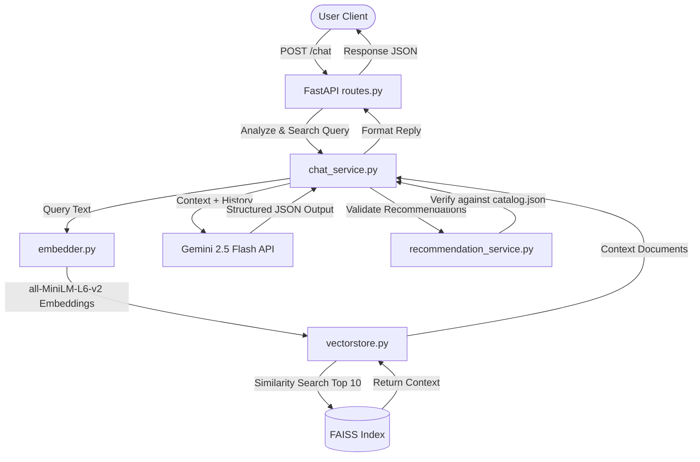

# SHL RAG Chatbot

A production-ready Retrieval-Augmented Generation (RAG) backend application that recommends **SHL Individual Test Solutions** through natural language conversation. It leverages **Google Gemini 2.5 Flash** for understanding user intent and **FAISS** with **SentenceTransformers (`all-MiniLM-L6-v2`)** for semantic catalog search.

---

## 🏗️ Architecture

The application implements a stateless, history-aware conversational RAG architecture:



### Key Architectural Highlights:
1. **Stateless Conversational State**: The API does not store conversation histories. The client sends the entire message history on every `/chat` request.
2. **Dynamic Search Query Generation**: Instead of searching using the last raw message, the system uses Gemini to generate a context-aware search query from the entire chat history. This ensures that refinements (e.g. *"Actually, make it a personality test instead"*) update the search query accurately.
3. **Zero-Hallucination Guardrails**: Any recommended test returned by the LLM is validated against the official `catalog.json` before being returned. If a recommendation's name doesn't match the catalog, it is discarded, and its URL/metadata is corrected to match the official values, ensuring 100% precision.
4. **Self-Initializing Index**: On server startup, the application checks if the catalog data or FAISS index exist. If missing, it runs the scraper to crawl `shl.com` (falling back to a rich built-in list of 30+ actual SHL tests) and builds the local FAISS index instantly.

---

## 🛠️ Tech Stack
- **Backend Framework**: Python 3.11+, FastAPI, Uvicorn
- **AI/LLM**: Google Gemini 2.5 Flash (via `google-generativeai`)
- **Semantic Retrieval**: SentenceTransformers (`all-MiniLM-L6-v2`), FAISS Vector Database
- **Web Scraper**: BeautifulSoup4, Requests
- **Validation**: Pydantic v2

---

## ⚙️ Environment Variables

Create a `.env` file in the root directory:

```env
# Gemini API Key (Required)
GEMINI_API_KEY=your_gemini_api_key_here

# Hugging Face Token (Optional, suppresses unauthenticated warnings)
HF_TOKEN=your_hf_token_here

# Server settings (Optional)
HOST=0.0.0.0
PORT=8000
LOG_LEVEL=info

# App performance settings (Optional)
CACHE_EXPIRATION_SECONDS=3600
MAX_RETRIES=3
```

---

## 🚀 Installation & Running Local

### 1. Clone & Set Up Virtual Environment
```bash
python -m venv venv
./venv/Scripts/activate  # Windows
source venv/bin/activate  # macOS/Linux
```

### 2. Install Dependencies
```bash
pip install -r requirements.txt
```

### 3. Run Self-Initialization
Run the scraper and generate the local FAISS index manually (or let the app do it automatically on startup):
```bash
python app/scraper/scrape_catalog.py
```

### 4. Run the Server
```bash
uvicorn main:app --reload
```
The server will start at `http://localhost:8000`. You can access the interactive Swagger documentation at `http://localhost:8000/docs`.

---

## 🧪 Testing & Evaluation

### Run Unit Tests
Unit tests are implemented using `pytest` and mock the Gemini API, making them runnable anywhere (even without an API key):
```bash
pytest tests/test_chatbot.py -v
```

### Run RAG Evaluator
To evaluate Recall@10, Precision, Latency, and Hallucination rates, run the evaluation script:
```bash
python tests/evaluate.py
```

---

## 📡 API Reference

### 1. Health Check
`GET /health`

**Response:**
```json
{
  "status": "ok"
}
```

### 2. Conversational Recommendation
`POST /chat`

**Request Body:**
```json
{
  "messages": [
    {
      "role": "user",
      "content": "I need an assessment for a Java Developer."
    }
  ]
}
```

**Response (Clarification state):**
*Note: Recommendations are empty `[]` when asking for clarification.*
```json
{
  "reply": "Which role level is this Java Developer for? Are they junior, mid-level, or senior? Also, would you like to evaluate coding skills, cognitive abilities, or their work personality?",
  "recommendations": [],
  "end_of_conversation": false
}
```

**Request Body (Refinement/Complete query):**
```json
{
  "messages": [
    {
      "role": "user",
      "content": "I need an assessment for a Java Developer."
    },
    {
      "role": "assistant",
      "content": "Which role level is this Java Developer for? Are they junior, mid-level, or senior? Also, would you like to evaluate coding skills, cognitive abilities, or their work personality?"
    },
    {
      "role": "user",
      "content": "It is for a senior developer. We want to test their coding skills."
    }
  ]
}
```

**Response (Recommendation state):**
```json
{
  "reply": "Based on your requirement to test the coding skills of a senior Java Developer, I recommend using the **Coding Simulation (Java)**. This is a practical, interactive assessment evaluating data structures, algorithms, and debugging. For general reasoning capacity, you may also consider the **Verify G+ (General Ability Test)**.",
  "recommendations": [
    {
      "name": "Coding Simulation (Java)",
      "url": "https://www.shl.com/en/assessments/skills-simulations/coding-java/",
      "test_type": "Coding"
    },
    {
      "name": "Verify G+ (General Ability Test)",
      "url": "https://www.shl.com/en/assessments/cognitive-ability/verify-g-plus/",
      "test_type": "Cognitive"
    }
  ],
  "end_of_conversation": false
}
```

---

## ☁️ Deployment (Render)

1. Create a new **Web Service** on Render.
2. Link your Git repository.
3. Configure the environment:
   - **Environment**: `Docker`
   - **Plan**: `Free` or higher
4. Under **Environment Variables**, add:
   - `GEMINI_API_KEY` = `<your-api-key>`
5. Render will automatically build the service using the included `Dockerfile` and publish it on your public Render domain.